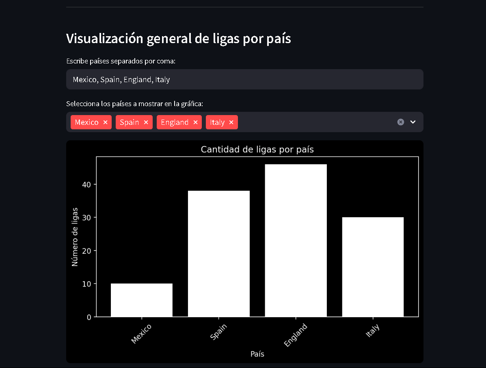
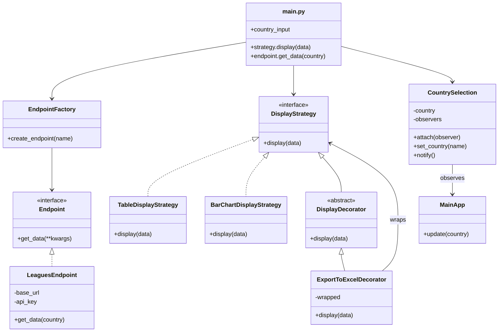

# Patrones de Diseño: Visualización de Ligas de Fútbol por País

Este proyecto permite consultar las ligas de fútbol de un país utilizando la API de Football-Data y mostrarlas en una interfaz construida con Streamlit. Además, el sistema está diseñado utilizando patrones de diseño para facilitar su escalabilidad y mantenimiento.

---

## Patrones de Diseño Aplicados

Se utilizaron los siguientes patrones de diseño en el proyecto:

### 1. **Factory Method** (Patrón Creacional)

- **Problema de diseño:** El sistema debía conectarse a múltiples endpoints (ligas, equipos, partidos, etc.), pero crear instancias directamente generaba código repetitivo y acoplado.
- **Razón de elección:** Factory Method permite delegar la creación de objetos a una fábrica que decide qué clase concreta retornar, promoviendo escalabilidad.
- **Solución aplicada:** Se implementó una clase `EndpointFactory` que crea el endpoint adecuado según el nombre proporcionado (`"leagues"`, etc.). Así, se puede agregar más endpoints sin modificar el código principal.

---

### 2. **Strategy** (Patrón de Comportamiento)

- **Problema de diseño:** Se requería mostrar los datos en diferentes formatos (tabla, gráfico, resumen) según el contexto.
- **Razón de elección:** Strategy encapsula diferentes algoritmos de presentación en clases intercambiables, permitiendo elegir la forma de visualización en tiempo de ejecución.
- **Solución aplicada:** Se creó la interfaz `DisplayStrategy` y una implementación concreta `TableDisplayStrategy`. Esto facilita añadir nuevas formas de presentación sin modificar la lógica existente.

---

### 3. **Observer** (Patrón de Comportamiento)

- **Problema de diseño:** Era necesario reaccionar automáticamente a cambios de estado, como cuando el usuario cambia el país ingresado.
- **Razón de elección:** Observer desacopla los componentes, permitiendo que múltiples observadores reaccionen al cambio de un observable.
- **Solución aplicada:** Se implementó una clase `CountryInput` que notifica a sus observadores cuando el país cambia. Un ejemplo de observador implementado es `LoggerObserver`, que registra los eventos en consola.

---

### 4. **Decorator** (Patrón Estructural)

- **Problema de diseño:** Se necesitaban funcionalidades adicionales (como exportar datos a Excel) sin modificar las clases de visualización ya existentes.
- **Razón de elección:** Decorator permite agregar funcionalidades adicionales a un objeto de forma dinámica y sin alterar su código base.
- **Solución aplicada:** Se implementó `ExcelExportDecorator`, que extiende una estrategia de visualización añadiendo la capacidad de descargar los datos como archivo Excel.

---

## Diagrama de clases en UML

